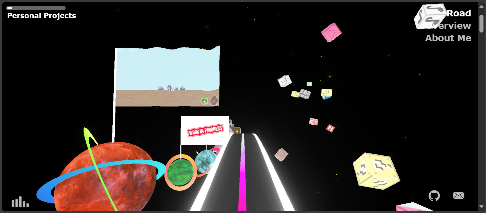

<div align="center">


My old website featuring a galaxy where each planet represents a project I developed.

Although it's no longer updated, you can still explore [PyroWorld](https://pyrowildx.github.io/PyroWorld/).



</div>

## 🛠️ How To Build

```
npm install
npm run dev
```

---

<div align="center">
  Copyright &#169; 2023 PyroWilDx. All Rights Reserved.
</div>
