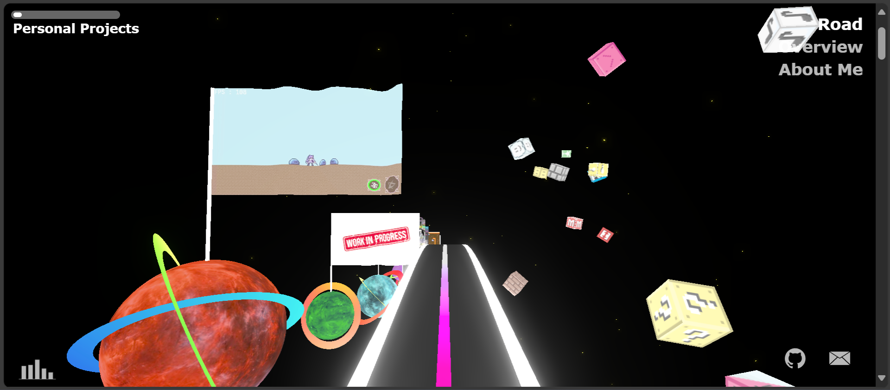

# PyroWorld

[**PyroWorld**](https://github.com/PyroWilDx/PyroWorld/) is my old website where I created a galaxy in which each planet represents a project I developed.

Although I no longer update it, you can still explore [PyroWorld](https://pyrowildx.github.io/PyroWorld/).



## Development Set-Up

<div align="center">

| [](https://www.typescriptlang.org/) | [](https://threejs.org/) | [](https://nodejs.org/) | [](https://code.visualstudio.com/) | [](https://www.microsoft.com/windows/) |
|---|---|---|---|---|

</div>

### How To Use

- Install npm dependencies.

```
npm install
```

- Start development server.

```
npm run dev
```

---

<div align="center">
  Copyright &#169; 2023 PyroWilDx. All Rights Reserved.
</div>
